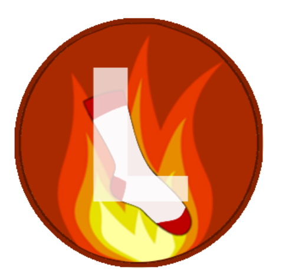

<!--
*** Thanks for checking out the Best-README-Template. If you have a suggestion
*** that would make this better, please fork the repo and create a pull request
*** or simply open an issue with the tag "enhancement".
*** Thanks again! Now go create something AMAZING! :D
***
***
***
*** To avoid retyping too much info. Do a search and replace for the following:
*** github_username, repo_name, twitter_handle, email, project_title, project_description
-->


<!-- PROJECT SHIELDS -->
<!--
*** I'm using markdown "reference style" links for readability.
*** Reference links are enclosed in brackets [ ] instead of parentheses ( ).
*** See the bottom of this document for the declaration of the reference variables
*** for contributors-url, forks-url, etc. This is an optional, concise syntax you may use.
*** https://www.markdownguide.org/basic-syntax/#reference-style-links
-->

<!-- [![Contributors][contributors-shield]][contributors-url]
[![Issues][issues-shield]][issues-url]
[][commit-activity-url]
[![MIT License][license-shield]][license-url] -->
<!-- [![Forks][forks-shield]][forks-url] -->
<!-- [![Stargazers][stars-shield]][stars-url] -->


<p align="center">
    <a href= "https://github.com/LitSocBot/LitSocBot/graphs/contributors" alt="Contributors">
        </a>
    <a href= "https://github.com/LitSocBot/LitSocBot/issues" alt="Issues">
        </a>
    <a href= "https://github.com/LitSocBot/LitSocBot/commits" alt="Contributors">
        </a>
</p>
  

<!-- PROJECT LOGO -->
<br />
<p align="center">
  <a href="https://github.com/LitSocBot/LitSocBot">
    
  </a>

  <h1 align="center">LitSocBot</h3>

<!--   <p align="center">
    A discord bot for any literary society
    <br />
    <a href="https://github.com/github_username/repo_name"><strong>Explore the docs »</strong></a>
    <br />
    <br />
    <a href="https://github.com/github_username/repo_name">View Demo</a>
    ·
    <a href="https://github.com/github_username/repo_name/issues">Report Bug</a>
    ·
    <a href="https://github.com/github_username/repo_name/issues">Request Feature</a>
  </p>
</p> -->


<!-- TABLE OF CONTENTS -->
<details open="open">
  <summary><h2 style="display: inline-block">Table of Contents</h2></summary>
  <ol>
    <li>
      <a href="#about-the-project">About The Project</a>
    </li>
    <li>
      <a href="#getting-started">Getting Started</a>
      <ul>
        <li><a href="#installation">Installation</a></li>
      </ul>
    </li>
    <li><a href="#usage">Usage</a></li>
    <li><a href="#contributing">Contributing</a></li>
    <li><a href="#license">License</a></li>
    <li><a href="#acknowledgements">Acknowledgements</a></li>
  </ol>
</details>


<!-- ABOUT THE PROJECT -->
## About The Project

<!-- [![Product Name Screen Shot][product-screenshot]](https://example.com) -->

discord bot be really cool


<!-- GETTING STARTED -->
## Getting Started

To start using the bot just follow the installation procedure.

### Installation

1. To add the bot to your server, just click on the link below
[Invite the bot to your server](https://discord.com/channels/856584011434688522/858053945695404042/860797214141972531 "LitSocBot's Invite Link")


<!-- USAGE EXAMPLES -->
## Usage
The bot uses the '!' prefix which means that any command to the bot must be preceded by the exclamation point ('!').
type ```!help``` in your server to see the list of commands   

The commands that can be used are:  

```!help```: prints the list of available commands  
```!help <choice>```: prints additional information about the input command   

General:
1. ```!isthere <choice>```: checks if the input exists or not
2. ```!itbooks <choice>```: returns of list of technical books related to the input choice 
3. ```!movies <choice>```: returns information about the input movie 
4. ```!wordswith <choice>```: returns a list of the words with the input word 
5. ```!ws```: returns the image of a wordsearch along with a list of the hidden words
6. ```!xkcd```: returns a random xkcd comic
7. ```!anagram <choice>```: returns the possible anagrams of the input word 
8. ```!debatopic <choice>```: returns a debate topic under the input category (list of categories can be found in ```!help debatopic```)
9. ```!debate``` returns a debate topic from an American api 
10. ```!debate addtop <choice>```: add a debate topic under a 'mods' category    

NYT Crossword:
1. ```!startcwd```: starts a crossword game
2. ```!answercwd <choice>```: checks if the entry is correct, adds it to the crossword if it is
3. ```!clues```: displays the clues for the crossword    

Custom Crossword: Generate a custom crossword from a list of words
1. ```!addword <choice>```: add the input word to the list
2. ```!delword <choice>```: remove the input word from the list
3. ```!createcwd```: creates the crossword
4. ```!showcwd```: displays the crossword
5. ```!showkey```: displays the solved crossword      

Cows and Bulls: <!-- (for info on how to play the game click [here](https://en.wikipedia.org/wiki/Bulls_and_Cows)): -->  
1. ```!startcb <choice>```: starts a game with the input number of digits 
2. ```!guesscb <choice>```: returns the number of cows and bulls for the guess
3. ```!stopcb```: ends the game

<!-- CONTRIBUTING -->
<!-- ## Contributing

Contributions are what make the open source community such an amazing place to be learn, inspire, and create. Any contributions you make are **greatly appreciated**.

1. Fork the Project
2. Create your Feature Branch (`git checkout -b feature/AmazingFeature`)
3. Commit your Changes (`git commit -m 'Add some AmazingFeature'`)
4. Push to the Branch (`git push origin feature/AmazingFeature`)
5. Open a Pull Request -->


<!-- LICENSE -->
## License

Distributed under the MIT License. See `LICENSE` for more information.

<!-- ACKNOWLEDGEMENTS -->
## Acknowledgements

need to make a list of the api's we used


<!-- MARKDOWN LINKS & IMAGES -->
<!-- https://www.markdownguide.org/basic-syntax/#reference-style-links -->
[contributors-shield]: https://img.shields.io/github/contributors/LitSocBot/LitSocBot.svg?style=for-the-badge
[contributors-url]: https://github.com/LitSocBot/LitSocBot/graphs/contributors
[forks-shield]: https://img.shields.io/github/forks/LitSocBot/LitSocBot.svg?style=for-the-badge
[forks-url]: https://github.com/LitSocBot/LitSocBot/network/members
[stars-shield]: https://img.shields.io/github/stars/LitSocBot/LitSocBot.svg?style=for-the-badge
[stars-url]: https://github.com/LitSocBot/LitSocBot/stargazers
[issues-shield]: https://img.shields.io/github/issues/LitSocBot/LitSocBot.svg?style=for-the-badge
[issues-url]: https://github.com/LitSocBot/LitSocBot/issues
[license-shield]: https://img.shields.io/github/license/LitSocBot/LitSocBot.svg?style=for-the-badge
[license-url]: https://github.com/LitSocBot/LitSocBot/blob/master/LICENSE.txt
[linkedin-shield]: https://img.shields.io/badge/-LinkedIn-black.svg?style=for-the-badge&logo=linkedin&colorB=555
[linkedin-url]: https://linkedin.com/in/LitSocBot
[commit-activity-shield]: https://img.shields.io/github/commit-activity/m/LitSocBot/LitSocBot?style=for-the-badge
[commit-activity-url]: https://github.com/LitSocBot/LitSocBot/commits
